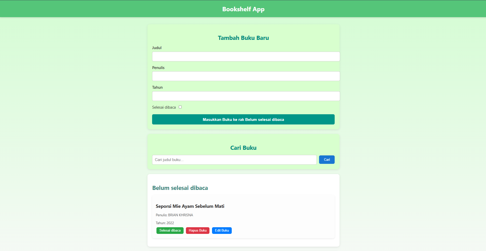

# 📚 Bookshelf App

Bookshelf App adalah aplikasi sederhana untuk mengelola daftar buku yang sudah dan belum selesai dibaca.  
Aplikasi ini dibuat sebagai bagian dari submission Dicoding Academy.

---

## 🚀 Fitur
- Menambahkan buku baru
- Memindahkan buku antar rak (belum selesai / selesai dibaca)
- Menghapus buku
- Mengedit informasi buku
- Mencari buku berdasarkan judul
- Data tersimpan di **localStorage**

---

## 🖼️ Tampilan Website


---

## 🛠️ Teknologi yang Digunakan
- HTML5
- CSS3
- JavaScript (DOM & LocalStorage)

---

## 📥 Cara Menjalankan
1. Clone repositori ini:
   ```bash
   git clone https://github.com/username/bookshelf-app.git
